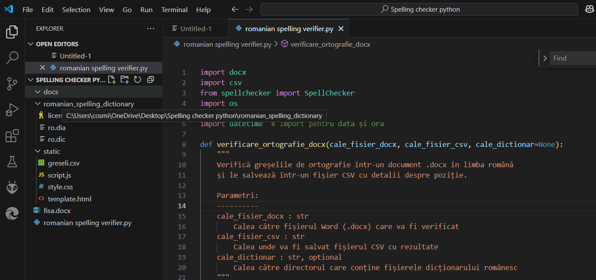
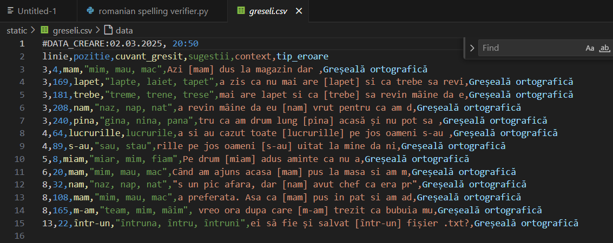
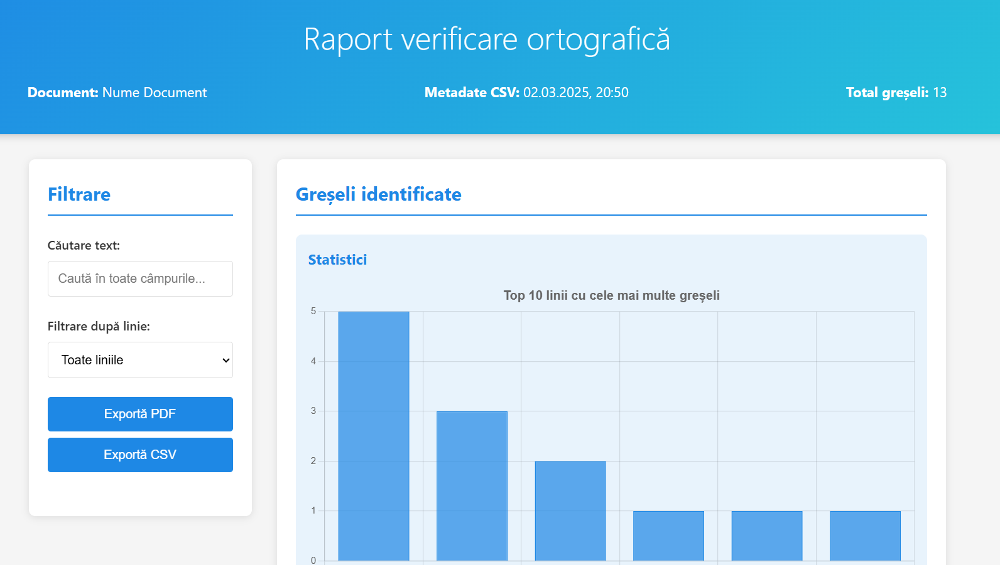
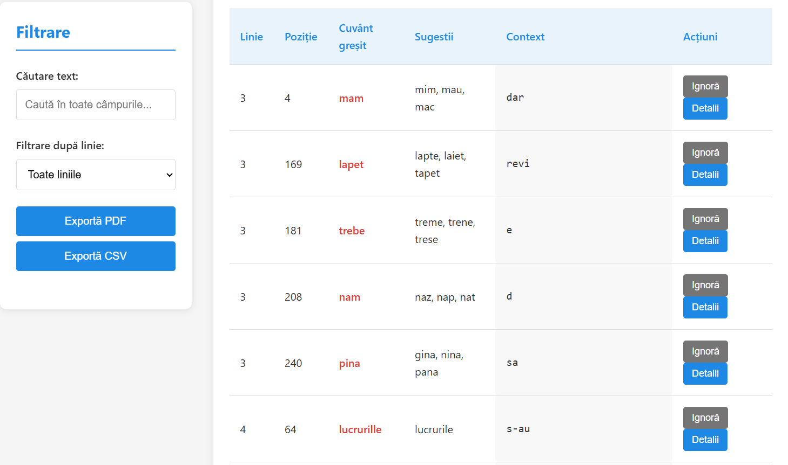

# 📝 Romanian Spelling Verifier

---

## 📌 Descriere

**Romanian Spelling Verifier** este un proiect care verifică un fișier `.docx` pentru:
- Greșeli ortografice în limba română
- Greșeli comune de tastatură (ex: litere inversate, spații lipsă etc.)

✅ După analiză:
- Salvează greșelile identificate într-un fișier `.csv`
- Generează un raport interactiv în browser (`HTML + CSS + JS`) pentru vizualizare ușoară

---

## 🗂️ Structura proiectului

📁 docs/
    📄 prezentare1.png
    📄 prezentare2.png
    📄 prezentare3.png
    📄 prezentare4.png
📁 romanian_spelling_dictionary/
    📄 license.md
    📄 ro.dia
    📄 ro.dic
📁 static/
    📄 greseli.csv
    📄 script.js
    📄 style.css
    📄 template.html
📄 fisa.docx
📄 README.md
📄 requirements.txt
📄 romanian spelling verifier.py

## Imagini

### Prezentare 1

### Prezentare 2

### Prezentare 3

### Prezentare 4

